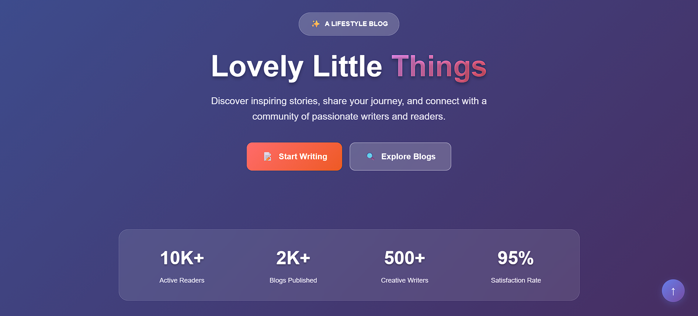
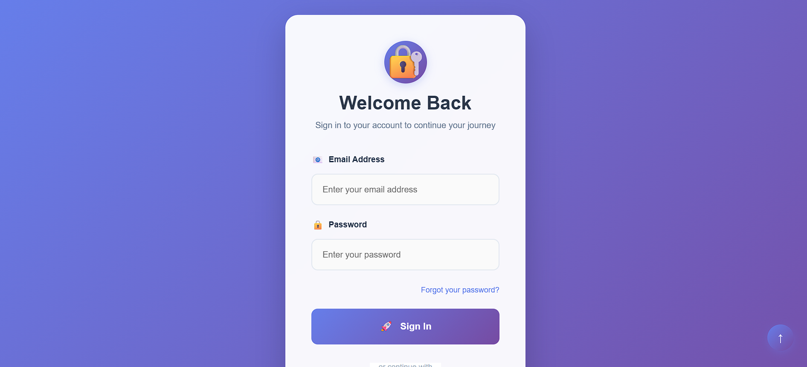
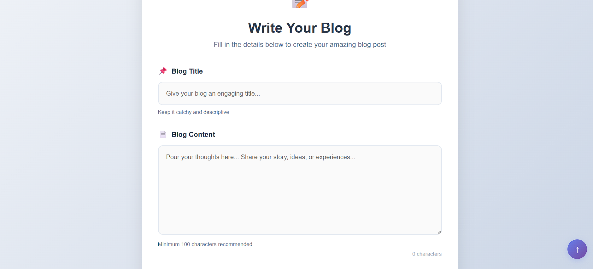
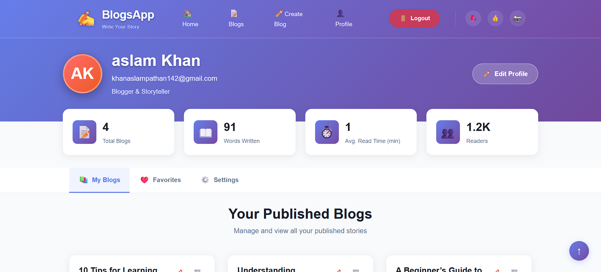

# 📖 Blog App (MERN Stack)

A full-stack **Blog Application** built with the **MERN stack** (MongoDB, Express.js, React, Node.js).  
Users can **sign up, log in, create blogs, view blogs, and manage their own content**.  

---

## 🚀 Features

- 🔑 **User Authentication** (Signup/Login with JWT)  
- ✍️ **Create, Read, Delete Blogs**  
- ⭐ **Favorite Blogs Management**  
- 👤 **User Profile** with user-specific blogs  
- 🔍 **Search Blogs** by title/content  
- 🌐 **Deployed** on:
  - **Backend:** Render  
  - **Frontend:** Vercel  

---

## 🛠️ Tech Stack

**Frontend:**  
- React (Vite) ⚡  
- Tailwind CSS 🎨  
- Framer Motion 🎥  

**Backend:**  
- Node.js 🟢  
- Express.js 🚂  
- MongoDB (Mongoose) 🍃  
- JWT Authentication 🔐  

**Deployment:**  
- Vercel (Frontend)  
- Render (Backend)  

---

## ⚙️ Environment Variables (.env)

This project uses environment variables to configure the **backend** and **frontend**.  
You should create `.env` files in both `backend` and `frontend` folders.  

---

### 1️⃣ Backend `.env` (in `backend/` folder)

```env
# MongoDB connection string
MONGO_URL=your_mongodb_connection_string

# JWT secret key for authentication
JWT_SECRET=your_secret_key

# Backend server port
PORT=8000

```
---

## ⚙️ Installation & Setup

### 1️⃣ Clone the Repository
```bash
git clone https://github.com/AslamKhanpathan142/blog-app-with-mern-stack.git
cd blog-app-with-mern-stack

```
---

## 🌍 Live Demo

Check out the deployed Blog App online:

- **My Website:** [Live Demo](https://blog-app-with-mern-stack-ten.vercel.app)  


---

## 📸 Screenshots

Here are some preview screens of the Blog App:

### 🏠 Home Page


### 🔑 Login Page


### 📝 Create Blog Page


### 👤 Profile Page



